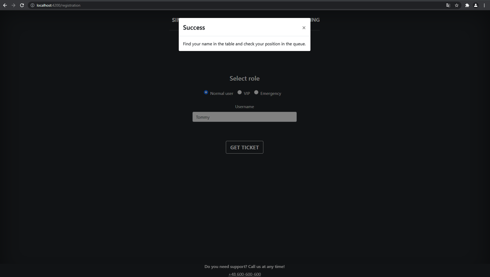
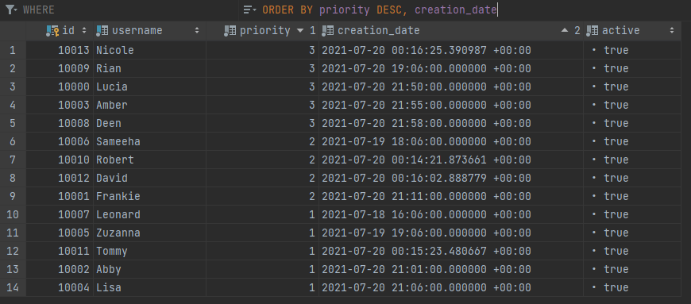

simple-queue
---------------------------------------------
Take your place in the queue

---------------------------------------------

##### This project contains technologies:

- Java 11
- Spring Boot 2.5.2
- Angular 12
- Ngx-bootstrap 6.2
- Docker Compose 3.8
- JPA + Hibernate
- PostgreSQL 13.3
- Liquibase 4.4.1
- Maven 3.6.2
- Lombok 1.18.12

###### To run the application you need to install: Java JDK 11 Node.js, Docker
---------------------------------------------

##### Features:

- generate ticket (depending on the role, you may need a password)
- see the current queue of all tickets
- first ticket will be removed every 20 sec

--------------------------------------------

#### How to run application:

Backend:

```
1. Build the project using Maven Wrapper
 
# Linux / MacOS
./mvnw clean install

# On Windows
mvnw.cmd clean install

# 2. Run the script that starts the PostgreSQL database via Docker Compose 

cd docker/dependencies

# Linux / MacOS
./start.sh

# On Windows
start.sh

# 3. Run class SimpleQueueApplication
```

Frontend:

```
# 1. Download all frontend dependencies by running command

npm install

# 2. Run frontend application 

npm start

# 3. Navigate to http://localhost:4200/
```

---------------------------------------------

##### Screens:

Welcome page


Registration page


Registration page - normal user - confirmation of ticket generation by modal


Registration page - vip - confirmation of ticket generation by modal


Registration page - emergency - confirmation of ticket generation by modal


List of all active tickets sorted by role, creation date, status


DB


---------------------------------------------
